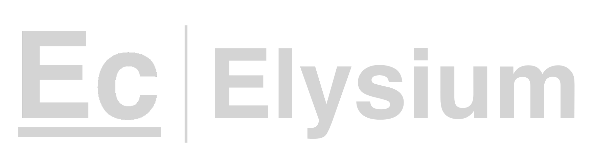

## Investment Thesis

IREN Limited sits at the intersection of two structural shifts: the institutionalization of Bitcoin as a treasury asset, and the surge in demand for AI compute infrastructure. The market is not yet pricing both simultaneously.

The company operates with one of the lowest power cost structures in the listed mining sector — approximately 2.5¢/kWh blended across its Australian and North American sites. That cost advantage is structural, not cyclical, and it translates directly into margin resilience when Bitcoin prices compress.

At $14.83, the stock prices in neither the full ramp of IREN's 100 EH/s hash rate target nor the optionality embedded in its HPC pivot. We see 89% upside to our base case of $28.00 over a 12-month horizon.

> "The Childress campus is not just a mining facility — it is stranded low-cost power that can be redirected toward whatever compute workload the market prices highest. That optionality has real value that a simple EV/EH multiple ignores."

The dominant near-term catalyst is the Childress, TX Phase 2 energization, which we estimate reaches full capacity by Q3 2026. This event alone would nearly double operational hash rate and position IREN as a top-five listed miner by capacity.

---

## Business Overview

IREN (formerly Iris Energy) is a Canadian-headquartered Bitcoin miner and HPC infrastructure operator, dual-listed on NASDAQ and ASX. Its operations span three sites:

- **Childress, Texas** — 800 MW flagship campus. Phase 1 (200 MW) is fully energized; Phase 2 (600 MW) is under active construction.
- **Mackay, British Columbia** — 30 MW hydro-powered facility.
- **Nanaimo, British Columbia** — 20 MW hydro-powered facility.

The owner-operator model is the key differentiator. Unlike co-location peers who lease power capacity, IREN owns its electrical infrastructure. This requires higher upfront capital expenditure but delivers cost predictability that peers structurally cannot match over a multi-year horizon.

### HPC & AI Cloud

IREN began offering GPU cloud compute services in H2 2025, with an initial installed base of approximately 512 NVIDIA H100 GPUs. Revenue remains small in absolute terms — roughly $18M annualized — but the Childress campus provides the stranded power necessary to scale this segment at near-zero marginal infrastructure cost. We treat HPC revenue as free optionality in our base case and model it conservatively.

---

## Financial Snapshot

| Metric | FY2024A | FY2025A | FY2026E | FY2027E |
|---|---|---|---|---|
| Revenue ($M) | 94 | 198 | 420 | 780 |
| BTC Mined | 4,820 | 8,100 | 17,500 | 32,000 |
| Gross Margin | 44% | 51% | 56% | 61% |
| Adj. EBITDA ($M) | 38 | 97 | 230 | 490 |
| Cash & Equiv. ($M) | 48 | 201 | 185 | 310 |
| BTC Holdings | 750 | 1,240 | 2,100 | 3,800 |
| Hash Rate (EH/s, avg) | 12 | 28 | 65 | 105 |

Revenue growth from FY2025A to FY2026E is driven almost entirely by hash rate expansion. The Childress Phase 2 energization contributes an estimated $180M in incremental annualized revenue at current network difficulty. BTC price assumed at $95,000 (FY2026E) and $110,000 (FY2027E) in our base case. Estimates are Elysium Research models.

---

## Valuation

We value IREN using a blended approach — EV/Installed Capacity as the primary method, supplemented by a five-year DCF and a Bitcoin NAV analysis.

| Method | Implied Price | Weight |
|---|---|---|
| EV / EH/s (3.5x × 100 EH target) | $29.50 | 50% |
| 5-Year DCF (12% WACC) | $26.00 | 35% |
| BTC NAV (1.1x) | $31.00 | 15% |
| **Blended Base PT** | **$28.00** | — |

Our bull case of $42.00 assumes BTC at $150,000, full 100 EH/s capacity by Q4 2026, and HPC revenue scaling to $200M annualized. The bear case of $10.00 reflects a BTC drawdown to $45,000 and Phase 2 delays extending beyond 18 months.

> "The asymmetry here is notable: our bull/bear spread is 4:1 in favor of upside, and the probability-weighted expected value sits well above the current price even under conservative assumptions."

---

## Key Risks

**Execution risk** is the most material near-term concern. The Childress Phase 2 build involves grid interconnection approvals from ERCOT that could slip by one to two quarters. A six-month delay would reduce our FY2026E revenue estimate by approximately $85M and compress the thesis timeline without invalidating it.

**Bitcoin price risk** is ever-present. At $45,000 BTC, IREN's cash cost of production — approximately $28,000 per coin at full capacity — still generates positive gross margin. However, EBITDA compression would be severe and the HPC business would need to fund operating overhead.

**Regulatory and grid scrutiny** of large-scale mining operations continues to increase in Texas. ERCOT has proposed curtailment protocols that could limit operational uptime during peak demand periods, creating a non-trivial operational variable not fully reflected in consensus estimates.
